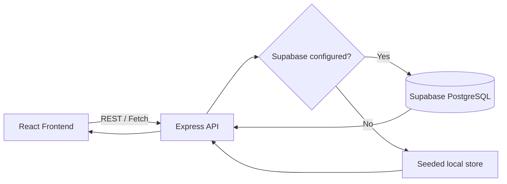

# KLE Tech Fest 2026

A production-shaped college fest website for **KLE Society's College, Gangavathi**. It combines a responsive React experience with an Express REST API and a Supabase/PostgreSQL schema for event registrations, participant counts and voucher lookup.

## Project Overview

- Five React Router pages: Home, Events, About, Gallery and Contact
- Local SVG imagery in `frontend/public/assets`
- Auto-rotating showcase with previous/next controls and indicator dots
- API-backed event capacities and global participant count
- Registration modal with validation, duplicate prevention and capacity checks
- Voucher lookup with printable/downloadable browser output
- Album tabs and gallery lightbox
- Supabase is optional during local UI development; the API uses seeded in-memory data until credentials are configured

## Architecture



## Registration Workflow

```text
User
  ↓
React registration form
  ↓
POST /api/registrations
  ↓
Required-field and email validation
  ↓
Duplicate email and capacity checks
  ↓
Supabase registrations table (or local fallback)
  ↓
Registration ID response
  ↓
React updates event and global counts
```

## Database Schema

`events` stores the event catalog, venues, date/time and capacity. `registrations` stores participant details and references `events.id`. The compound unique constraint on `(event_id, email)` prevents duplicate registration for an event.

## Installation

Requirements: Node.js 18+ and a Supabase project for persistent data.

```bash
npm run install:all
```

Create a root `.env` from `.env.example`:

```env
PORT=5000
SUPABASE_URL=https://your-project.supabase.co
SUPABASE_ANON_KEY=your-supabase-anon-key
SUPABASE_SERVICE_ROLE_KEY=your-supabase-service-role-key
```

The API prefers `SUPABASE_SERVICE_ROLE_KEY` because it runs server-side and must write registrations when Supabase Row Level Security is enabled. Do not expose this key in frontend code or commit it to Git.

Run `supabase/schema.sql` in the Supabase SQL editor, then start both applications:

```bash
npm run dev
```

The Vite frontend runs at `http://localhost:5173` and the API at `http://localhost:5000`. To point the frontend at another API, set `VITE_API_URL` in `frontend/.env.local`.

## Deploy on Render

This repository includes `render.yaml` for a free Render deployment with separate services:

1. In Render, choose **New > Blueprint** and connect this GitHub repository.
2. Keep the two services defined in `render.yaml`: `kle-tech-fest-api` (Web Service) and `kle-tech-fest-frontend` (Static Site).
3. Enter `SUPABASE_URL`, `SUPABASE_ANON_KEY` and the Supabase **service role** key when Render prompts for the API service environment variables. The service role key is available in Supabase under **Project Settings > API**.
4. Deploy. The frontend is configured to call `https://kle-tech-fest-api.onrender.com/api` and client-side routes are rewritten to `index.html`.

Render free web services sleep after inactivity, so the first API request after a quiet period may take a few seconds.

## API

- `GET /api/events` returns events with `registered` and `remaining` counts.
- `GET /api/events/:id` returns one event.
- `GET /api/events/:id/count` returns capacity information.
- `POST /api/registrations` accepts `{ name, email, phone, college, eventId }`.
- `GET /api/participants/count` returns `{ count }`.
- `POST /api/voucher` accepts `{ email }` and returns the latest registration.
- `GET /api/health` returns API status.

Registration success response includes `registration_id`, participant details and the event. Error responses use HTTP 400 for invalid input, 404 for missing resources and 409 for duplicates/full events.

## Screenshots

Run the frontend, open the five routes in a browser and capture the Home, Events, Gallery and Contact views for submission documentation. This repository keeps the screenshots workflow environment-independent rather than committing generated browser output.

## Future Improvements

Admin dashboard, QR-code check-in, online payments, email confirmation, live leaderboards and certificate generation.
